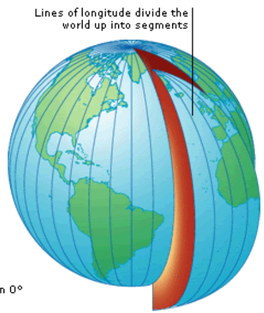

# test-task-getshop

Приложение реализует кеш-сервер для погоды. Сервер позволяет узнать погоду по городу, id города (может быть найден тут: http://bulk.openweathermap.org/sample/), zip-коду или координатам.

### Запросы к серверу

По городу

    /city?q={Название города}
    /city?q=London

По id

    /cityid/?id={Идентификатор}
    /cityid/?id=2172797
    
По зипкоду

    /zipcode/?zip={zip-код}
    /zipcode/?zip=94040,us

По координатам 

    /coords/?lat={Широта}&lon={Долгота}
    /coords/?lat=35&lon=139

### Настройки сервера

Ключ для OpenWheaterMap передается посредством аргумента командной строки

    stack run -- --api {ключ}

Все остальные параметры настраиваются посредством конфигурационного файла config/congif.yaml

#### Параметры

port: порт, на котором будет запущен сервер

    port: 8004

timeError: опционально, допустимая погрешность для времени, еденица измерения -- секунды, значение по умолчанию -- 1200 (20 минут)

    timeError: 3600

rangeError: опционально, допустимая погрешность для локации, еденица измерения -- километры, значение по умолчанию -- 30

    rangeError: 100

updateTime: опционально, промежуток времени между автоматическими обновлениями, еденица измерения -- секунды, значение по умолчанию -- 1800 (30 минут)

    udpateTime: 3600

locations: список локаций, для которых будет производится автоматическое обновление данных

##### Формат данных локаций

typ: показывает, по каким данным будут производится запросы

    typ = "city" | "cityId" | "zipCode" | "coords"

val: для поиска по городу, id и зипкоду:
- "city": Название города
- "cityId": Идентификатор
- "zipCode": zip-код локации

        - typ: city
          val: London
        - typ: cityId
          val: "2172797"
        - typ: zipCode
          val: "94040,us"

lat/lon: для поиска по координатам. Задает широту и долготу соответственно

        - typ: coords
          lat: "35"
          lon: "139"

### Внутреннее устройство

Для хранения данных используется Redis. Всего используется 4 хранилища:
- Temperature_Ordered_Set : Ordered Set
- Cities_Coords_Map : HashMap
- CitiesIDs_Coords_Map : HashMap
- zipcode_Coords_Map : HashMap

Первое используется для хранения JSON'а с погодой по координатам, оставшиеся три задают соответствие  (Описание места -> его координаты). 

Когда происходит первый запрос локации не по координатам сервер честно отправляет запрос на сервер OpenWheatherMap и из полученого JSON'а получает координаты, которые сохраняет в HashMap'е 

Данные в Ordered Set'е хранятся упорядоченные по долготе (longitude)

Для быстрого доcтупа к данным по координатам программа изначально высчитывает две точки, которые находятся на длине растояния погрешности от данного места, если при этом идти строго на запад или восток. Теперь, если взять долготу этих точек, мы можем получить сектор, в котором обязательно будут лежать все точки, которые находятся на расстоянии меньше расстояния погрешности. 

После этого из Set'а берутся все точки в указаном сегменте, и среди них линейно ищется ближайшая.

При каждом обращении к серверам OpenWheatherMap происходит обновление данных в Set'e
